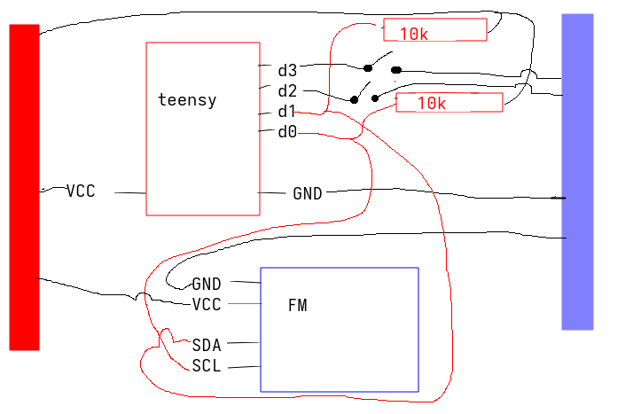

# teensy2_fm_radio

Layout goes something like this:

The buttons are currently there for tuning the channel of the emitted radio waves. The resistors might not be necessary.

It is a very basic version and not all features of the fm transmitter are used. Please refer to the data sheet of KT0803L chip for more feature usage~ 😗

## Parts

- [teensy 2.0](https://www.pjrc.com/store/teensy.html), it uses ATMEGA32u4 [chip pdf](https://ww1.microchip.com/downloads/en/DeviceDoc/Atmel-7766-8-bit-AVR-ATmega16U4-32U4_Datasheet.pdf)
- elechouse fm transmitter v2.0 or similar (search in search engine, there seems to be no official product page), the one that uses KT0803L chip. [chip pdf](https://datasheet4u.com/datasheets/KTMicro/KT0803L/791333)
- some cables and some resistors maybe?

## How to use

These are roughly the steps that should be needed to get this running, on linux at least.

1. Install arduino IDE

    a. file -> preferences -> add additional board manager urls

    b. add `https://www.pjrc.com/teensy/package_teensy_index.json`

2. Prepare usb for teensy

    a. get teensy rules 

      `wget https://www.pjrc.com/teensy/00-teensy.rules`

    b. move teensy rules

      `sudo cp 00-teensy.rules /etc/udev/rules.d/`

    c. reload usb system

      `sudo udevadm control --reload-rules && sudo udevadm trigger`

3. open the fm_radio.ino and upload it to the teensy (may need to press the program button on teensy once)

4. connect an audio cable from some source to the fm transmitter, tune a oldschool radio to the frequency and listen to it! 🎶